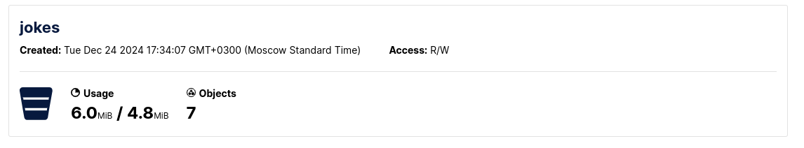
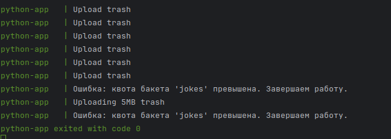

Как запустить:
```
docker compose up
```
Что происходит на сервере:

Загружается больше, чем возможно по причине того, что scanner не успевает понять, что превышен лимит.
Если попытаться загрузить файл, больше чем размер бакета, то выдаст сразу ошибку.

Что происходит на клиенте:

Сначала грузим файл с полезнйо нагрузкой, а даллее грузим мусорные, до тех пор пока не сработает ошибка по
месту на диске.